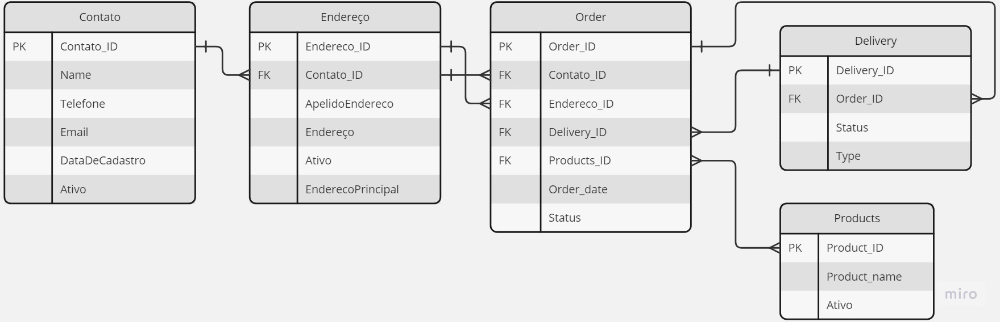

# Projeto exploratório API de Pedidos

Esse projeto está sendo desenvolvido para fins de estudo em .NET.  
O objetivo final é criar um sistema pra simular o funcionamento de um ecommerce.  

A ideia é ter uma relação de tabelas mais ou menos nesse padrão.  

